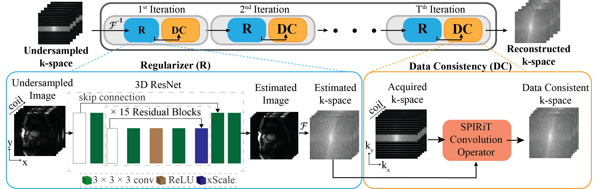

# SCR-DL
Accelerated Cardiac Cine with Spatio-Coil Regularized Deep Learning Reconstruction

[[Harvard Dataverse](https://dataverse.harvard.edu/dataset.xhtml?persistentId=doi:10.7910/DVN/3JWEBB)]

Please cite the following:

# SCR-DL

We sought to develop a spatio-coil regularized iterative deep learning reconstruction (SCR-DL) to accelerate cine CMR.

The trained model can be found under [[Harvard Dataverse](https://dataverse.harvard.edu/dataset.xhtml?persistentId=doi:10.7910/DVN/3JWEBB)] with the name of "best_model_ResNet.pth".

Training and testing requires the following format as the input:

Training:

kspace = M x N x Coil (complex),
ref_kspace = M x N x Coil (complex),
mask = M x N x 2 (single) - this can be an empty matrix,
acs_end = 1 - assign to 1,
acs_start = 1 - assign to 1,

Testing:

kspace = M x N x Coil (complex)
ref_kspace = M x N x Coil (complex)
mask = M x N x 2 (single) - this can be an empty matrix
acs_end = 1 - assign to 1
acs_start = 1 - assign to 1

An example dataset is included under [[Harvard Dataverse](https://dataverse.harvard.edu/dataset.xhtml?persistentId=doi:10.7910/DVN/3JWEBB)] with the name of "example_test.mat". 

SCR-DL Schematic:

# Abstract

Purpose
To develop an iterative deep learning (DL) reconstruction with spatio-coil regularization and multichannel k-space data consistency for accelerated cine imaging.

Methods
This study proposes a Spatio-Coil Regularized DL (SCR-DL) approach for iterative deep learning reconstruction incorporating multicoil information in data consistency and regularizer. SCR-DL uses shift-invariant convolutional kernels to interpolate missing k-space lines and reconstruct individual coil images, followed by a regularizer that operates simultaneously across spatial and coil dimensions using learned image priors. At 8-fold acceleration, SCR-DL was compared with Generalized Autocalibrating Partially Parallel Acquisition (GRAPPA), sensitivity encoding (SENSE)-based DL and spatio-temporal regularized (STR)–DL reconstruction. In the retrospective undersampled cine, images were quantitatively evaluated using normalized mean square error (NMSE) and structural similarity index measure (SSIM). Additionally, agreement for left-ventricular ejection fraction and left-ventricular mass were assessed using prospectively accelerated cine images at 2-fold and 8-fold accelerations.

Results
The SCR-DL algorithm successfully reconstructed highly accelerated cine images. SCR-DL had significant improvements in NMSE (0.03 ± 0.02) and SSIM (91.4% ± 2.7%) compared with GRAPPA (NMSE: 0.09 ± 0.04, SSIM: 69.9% ± 11.1%; p < 0.001), SENSE-DL (NMSE: 0.07 ± 0.04, SSIM: 86.9% ± 3.2%; p < 0.001), and STR-DL (NMSE: 0.04 ± 0.03, SSIM: 90.0% ± 2.5%; p < 0.001) with retrospective undersampled cine. Despite the 3-fold reduction in scan time, there was no difference between left-ventricular ejection fraction (59.8 ± 4.5 vs. 60.8 ± 4.8, p = 0.46) or left-ventricular mass (73.6 ± 19.4 g vs. 73.2 ± 19.7 g, p = 0.95) between R = 2 and R = 8 prospectively accelerated cine images.

Conclusions
SCR-DL enabled highly accelerated cardiac cine imaging, significantly reducing breath-hold time. Compared with GRAPPA or SENSE-DL, images reconstructed with SCR-DL showed superior NMSE and SSIM.
